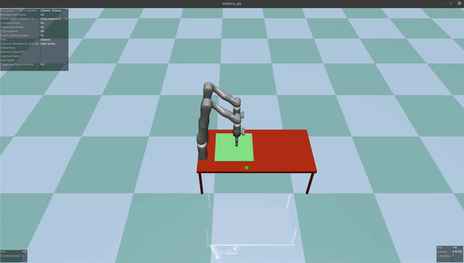
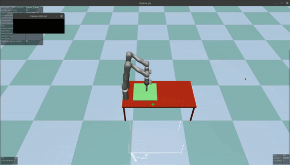

# mujoco-fling

|  |  |  |

This Python project uses MuJoCo simulation to control [six degrees of freedom Gen3 robotic arm](https://www.kinovarobotics.com/product/gen3-robots). The project aims to control the robot with fling action on cloth. For instructions on running the program, please see below.

## Install requirements

```bash
pip install -r ./requirements.txt
```

## Start demo on a specific action

```bash
bash script_fling.script
```
## Acknowledgement

This repository is developed from [Dr. Cui](https://www.jindacui.com/bio) source code.
